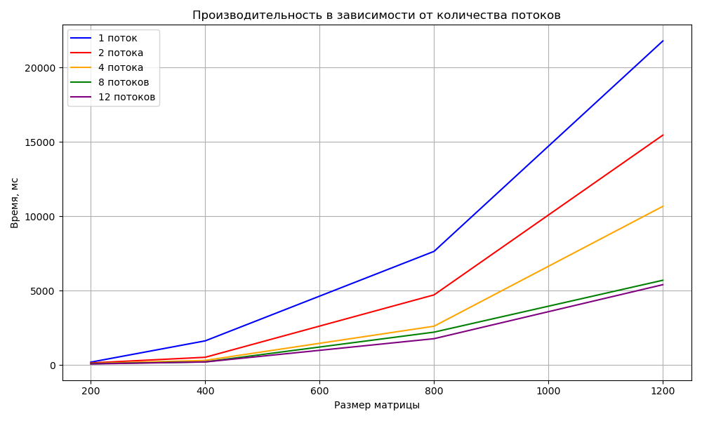

# Отчёт по лабораторной работе №1
## Реализация алгоритма перемножения матриц

### Цель работы
Разработать программу для умножения двух матриц с замером времени выполнения и автоматической верификацией результата.

---

#### 1. Генерация матриц (`generate_matrix.py`)
- Создание матриц произвольного размера со случайными элементами
- Парсинг аргументов командной строки:
  - Файл для записи
  - Размеры матрицы (строки, столбцы)
  - Диапазон значений элементов
- Сохранение матриц в текстовые файлы с указанием размерности

#### 2. Основной алгоритм (`main.cpp`)
- `ReadMatrix()` - считывание размеров и элементов матриц из файлов в двумерные векторы
- Проверка возможности умножения (количество столбцов первой матрицы должно равняться количеству строк второй)
- `MultiplyMatrix()` - реализация алгоритма умножения матриц O(n^3)
- Замер времени выполнения
- Проверка при помощи `equivalence.py`
- Запись матриц и результаты времени и корректности

#### 3. Перемножение матриц с распараллеливанием (`MultiplyMatrix()`)
 К стандартному перемножению матриц было добавлено распараллеливание при помощи OpenMP.
Поэтому процесс перемножения можно было разделить на несколько потоков. Это в разы ускоряет процесс, что можно увидеть из результатов.

#### 4. Верификация результата (`equivalence.py`)
- Считывание исходных матриц из тех же текстовых файлов
- Сравнение результата с эталонным умножением через `numpy.dot()`
- Возврат кода: `0` - результаты совпадают, `1` - обнаружено расхождение

#### 5. **Формирование отчёта**
- Запись результирующей матрицы, времени выполнения и статуса верификации в файл `matrixAB.txt`

#### 6. Таблица и график зависимости времени от размера

| Размер | Кол-во потоков | Время мс | Размер | Кол-во потоков | Время мс |
|--------|----------------|----------|--------|----------------|----------|
| 200 | 1 | 193 | 800 | 1 | 7637 |
| 200 | 2 | 139 | 800 | 2 | 4714 |
| 200 | 4 | 101 | 800 | 4 | 2608 |
| 200 | 8 | 90 | 800 | 8 | 2209 |
| 200 | 12 | 71 | 800 | 12 | 1769 |
| 400 | 1 | 1624 | 1200 | 1 | 21778 |
| 400 | 2 | 520 | 1200 | 2 | 15449 |
| 400 | 4 | 310 | 1200 | 4 | 10663 |
| 400 | 8 | 210 | 1200 | 8 | 5697 |
| 400 | 12 | 206 | 1200 | 12 | 5399 |

По таблице видно, что есть огромное отличие во времени расчёта при изменении кол-ва потоков.
