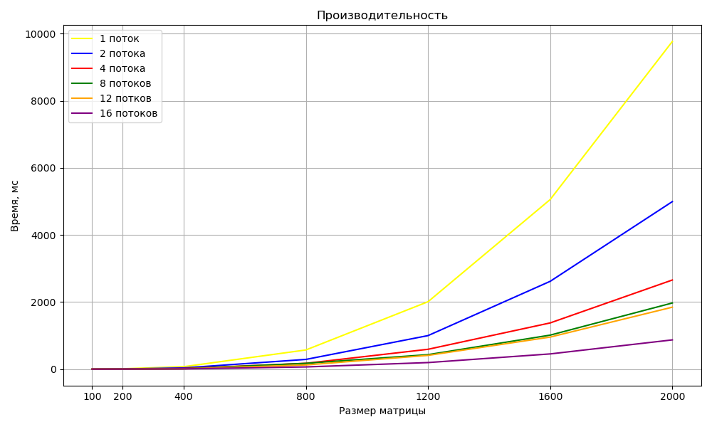

# Отчёт по лабораторной работе №3
## Реализация алгоритма перемножения матриц с использованием технологии MPI

### Цель работы
Разработать программу для умножения двух матриц с замером времени выполнения и автоматической верификацией результата.

---

#### 1. Генерация матриц (`generate_matrix.py`)
- Создание матриц произвольного размера со случайными элементами
- Парсинг аргументов командной строки:
  - Файл для записи
  - Размеры матрицы (строки, столбцы)
  - Диапазон значений элементов
- Сохранение матриц в текстовые файлы с указанием размерности

#### 2. Основной алгоритм (`main.cpp`)
- `ReadMatrix()` - считывание размеров и элементов матриц из файлов в одномерный вектор
- Проверка возможности умножения (количество столбцов первой матрицы должно равняться количеству строк второй)
- `MultiplyMatrix()` - реализация алгоритма умножения матриц O(n^3)
- Замер времени выполнения
- Проверка при помощи `equivalence.py`
- Запись результата времени и корректности для всех размеров матриц

#### 3. Перемножение матриц с распараллеливанием (`MultiplyMatrix()`)
 К стандартному перемножению матриц было добавлено распараллеливание при помощи технологии MPI.
Поэтому процесс перемножения можно было разделить на несколько ядер. Это в разы ускоряет процесс, что можно увидеть из результатов, в таблице и на графике.

#### 4. Верификация результата (`equivalence.py`)
- Считывание исходных матриц из тех же текстовых файлов
- Сравнение результата с эталонным умножением через `numpy.dot()`
- Возврат кода: `0` - результаты совпадают, `1` - обнаружено расхождение

#### 5. **Формирование отчёта**
-Размер матриц и время её перемножения со статусом верификации записываются в `result.txt`

#### 6. Таблица и график зависимости времени от размера

| Размер | Кол-во потоков | Время мс | Размер | Кол-во потоков | Время мс |
|--------|----------------|----------|--------|----------------|----------|
| 200 | 1 | 4 | 1200 | 1 | 942 |
| 200 | 2 | 2 | 1200 | 2 | 529 |
| 200 | 4 | 1 | 1200 | 4 | 394 |
| 200 | 8 | 1 | 1200 | 8 | 301 |
| 400 | 1 | 30 | 1600 | 1 | 2348 |
| 400 | 2 | 16 | 1600 | 2 | 1341 |
| 400 | 4 | 8 | 1600 | 4 | 847 |
| 400 | 8 | 8 | 1600 | 8 | 784 |
| 800 | 1 | 226 | 2000 | 1 | 4505 |
| 800 | 2 | 125 | 2000 | 2 | 2476 |
| 800 | 4 | 79 | 2000 | 4 | 1686 |
| 800 | 8 | 87 | 2000 | 8 | 1590 |

По таблице видно, что есть огромное отличие во времени расчёта при изменении кол-ва потоков. Так же можно заметить, что при увелечении ядер снижается эффективность от их добавление, связанное с записью данных, особенно заметно на матрицах маленького размера.
